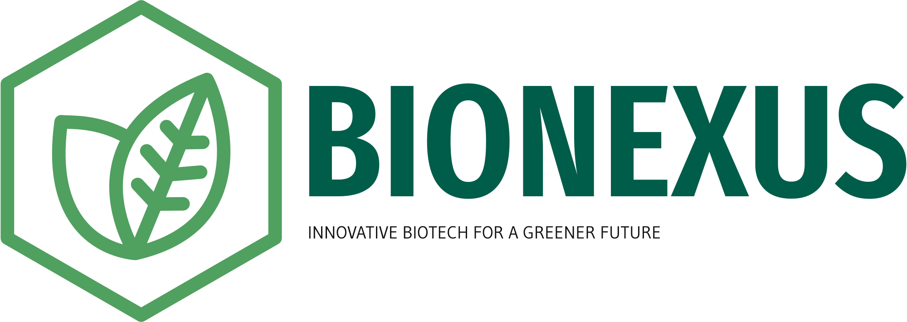

## Tech Stack:

**Client:** React, JavaScript, and i18next

## Used By:

This project was built with the intention of creating a website for my Junior Entprise in Hungary, BioNexus.

## Features:

- Since the junior enterprise is located in Hungary, the user is able to switch languages in the navbar component through an integration with I18next API.
- Responsive navbar. It also indicates which section of the website the user is on by highlighting texts with green.
- Form validation through react-hook-form.

## File Structure:
### 1. src/pages
- Stores all of the different pages of the website

### 2. src/components 
- Stores React components that are being shared throughout the application.

### 3. src/assets 
- Stores images that will be used in the application

 ## React Hooks:

- useState
- useEffect
- React Router DOM
- useRef
- useForm
- useNavigate

## Dependencies:

- i18next
- i18next-browser-languagedetector
- i18next-http-backend
- react-cookie-consent
- react-hook-form
- firebase
- framer-motion
- react-scroll
- react-router-dom
- framer-motion
- react-intersection-observer

    
    
